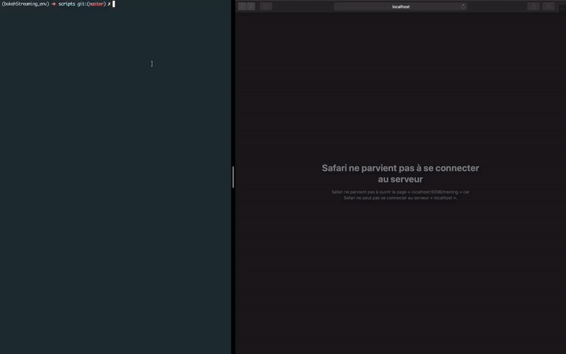

# Epochsviz (Bokeh + PyTorch)

This is a simple high level visualization module built on top of <a href="https://bokeh.pydata.org/en/latest/">Bokeh</a> in order to visualize training and validation losses during the training (in real time).
This module was tested using <a href="https://pytorch.org">PyTorch</a>.

### Installation
Clone the repository in your project location  
`git clone https://github.com/Mdhvince/Epochsviz.git`  

Go to the folder  
`cd Epochsviz`  

Install the necessary dependencies  
`pip install -r requirements.txt`  

### Get Started
Import the module in your python script
`from Epochsviz.epochsviz import Epochsviz`

Create an Epochsviz object  
`eviz = Epochsviz()`
For a custom Epochsviz object, you can change these attribute  
```
Epochviz(title='figure', plot_width=600, plot_height=600,
                 name_train_curve='Training loss', color_train='red',
                 name_val_curve='Validation loss', color_val='green',
                 line_width_train=2, line_width_val=2)
```

Since this module was tested using <a href="https://pytorch.org">PyTorch</a>, I'll show you how to use it within the `train()` function that we usually use for training a Neural Network.  

The unique line to add in your training loop is  
```
eviz.send_data(current_epoch=epoch,
			   current_train_loss=train_loss,
			   current_val_loss=valid_loss)
```
- current_epoch: the current epoch in the loop
- current_train_loss: the current loss on the train loader data
- current_val_loss: the current loss on the validation loader data
  
Find an example here  
```
def train(n_epochs=n_epochs,
          train_loader=train_loader, valid_loader=valid_loader,
          save_location_path=save_location_path):

    for epoch in range(1, n_epochs+1):
        # TRACK LOSSES AS USUAL
        # ...
        for data in train_loader:
            # DO YOUR USUAL TRAINING STEPS
            # ...
        
        model.eval()
        for data in valid_loader:
        	# DO YOUR USUAL VALIDATION STEPS
        	# ...

        eviz.send_data(current_epoch=epoch,
                       current_train_loss=train_loss,
                       current_val_loss=valid_loss)
```
Finally we start the thread by adding this line after the function  
`eviz.start_thread(train_function=train)`  

- train_function: the name of your train function (without parameters), so make sure all params are declared before.

#### Run the script in the Terminal
If your script is named `training.py`, instead of launching the script with the python command, you have to launch it with the bokeh one `bokeh serve --show training.py`.  
This command will automatically open your default browser and display the result. If you want to visualize the result in another browser remove the `--show` option and copy the link in the other browser.

#### See result in the browser


### TO DO
- [ ] Add a method to Terminate the thread when the training is done


